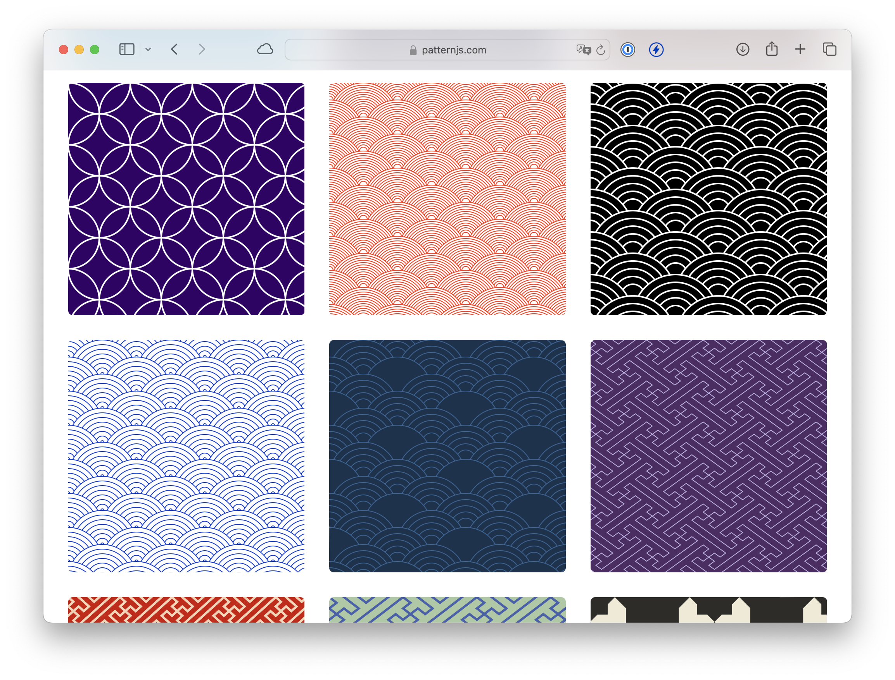

# pattern.js

JavaScript pattern rendering library.

## Details

Pattern.js constitutes a small number of utilities for drawing repeating patterns, and high-level APIs for specific patterns.

See it [here](https://patternjs.com).
